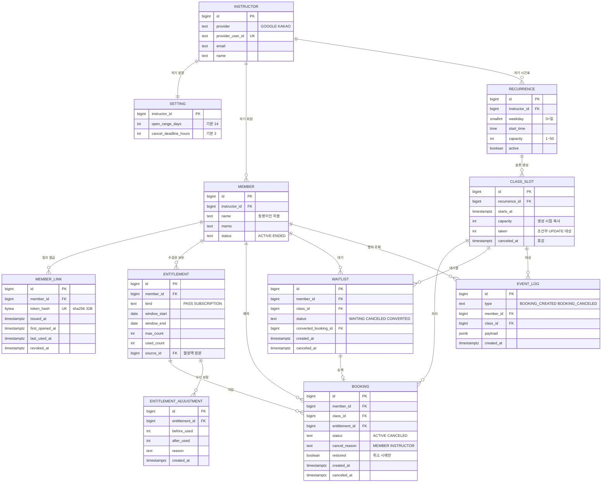

# 컨텍스트 맵

> 1차 이전본. 도메인별 ERD로 나누기 전까지 **전체 ERD를 임시로 여기 둔다.** 2차에서 도메인 관계와 도메인 사이 FK만 남긴다.

## 전체 ERD

엔티티 11개. `||--o{`는 1 대 다, `||--||`는 1 대 1, `||--o|`는 1 대 0또는1이다.



| 테이블 | 도출 PRD | 역할 |
|---|---|---|
| instructor | 1 | 강사 계정. OAuth 가입. **강사마다 1행** |
| setting | 1 · 5 | **강사별** 설정. 오픈 범위, 취소 마감 시간 |
| recurrence | 1 | 반복 규칙. 요일 · 시각 · 정원. 매주 고정 |
| class | 1 | 슬롯. 회원이 예약하는 단위. 그림에서는 CLASS_SLOT (열린 질문 Q1) |
| member | 1 | 회원. 강사 1명에게 귀속 |
| member_link | 1 · 2 | 개인 링크 토큰의 해시. 재발급하면 행이 늘어난다 |
| entitlement | 0 정의 · 1 생성 | 수강권. 횟수권과 월 정액을 한 모델로 표현 |
| entitlement_adjustment | 3 | 강사의 수기 잔여 보정 이력 |
| booking | 3 · restored는 5 | 예약. 어느 수강권에서 차감했는지와 취소 사유를 보관 |
| waitlist | 4 | 대기. 순번 컬럼은 없다 |
| event_log | 3 | 성공 지표 집계용 이벤트. 화면에 노출하지 않는다 |

## 데이터 격리

소유자 컬럼은 **뿌리 세 곳에만** 둔다. 나머지 테이블은 부모를 타고 올라가면 소유자를 알 수 있다.

| 테이블 | `instructor_id` | 소유자를 어떻게 아나 |
|---|---|---|
| setting | **PK 그 자체** | 직접 |
| member | **있음** | 직접. 부모가 없다 |
| recurrence | **있음** | 직접. 부모가 없다 |
| class | 없음 | `recurrence_id` → `recurrence.instructor_id` |
| member_link · entitlement · booking · waitlist · event_log | 없음 | `member_id` → `member.instructor_id` |
| entitlement_adjustment | 없음 | `entitlement_id` → `entitlement.member_id` → `member.instructor_id` |

중복 컬럼을 두면 부모와 어긋날 수 있다. 테이블 11개에 조인이 얕으므로 부모를 타는 쪽을 택한다.

격리는 DB가 자동으로 해주지 않는다. **강사 화면의 모든 쿼리에 소유자 조건이 들어가야 한다.** 한 군데 빠뜨리면 남의 데이터가 나온다. 강사가 1명뿐인 테스트 데이터에서는 조건을 빠뜨려도 결과가 같아 통과하므로, **테스트 데이터에 강사를 반드시 2명 이상 만든다.**

### 강사 화면의 격리 쿼리

모든 강사 화면 쿼리에 소유자 조건이 들어간다.

```sql
-- 회원 목록
SELECT * FROM member
 WHERE instructor_id = $me AND status = 'ACTIVE';

-- 시간표. class에는 instructor_id가 없으므로 recurrence를 탄다
SELECT c.*
  FROM class c
  JOIN recurrence r ON r.id = c.recurrence_id
 WHERE r.instructor_id = $me
   AND c.canceled_at IS NULL
   AND c.starts_at >= now();

-- 수업별 예약자 명단
SELECT m.name
  FROM booking b
  JOIN member m     ON m.id = b.member_id
  JOIN class c      ON c.id = b.class_id
  JOIN recurrence r ON r.id = c.recurrence_id
 WHERE b.class_id = $1 AND b.status = 'ACTIVE'
   AND r.instructor_id = $me;   -- 남의 수업 id를 넣어도 빈 결과
```

마지막 쿼리의 소유자 조건이 특히 중요하다. 없으면 다른 강사의 `class_id`를 넣는 것만으로 그쪽 명단이 나온다.
