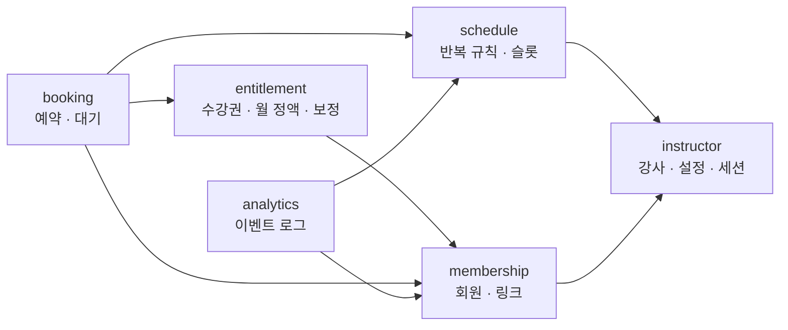

# 컨텍스트 맵

도메인 6개가 서로 어떻게 연결되는지만 보여준다. **테이블과 컬럼이 들어간 ERD는 도메인별로 나뉘어 있다.**

| 도메인 | 테이블 | ERD |
|---|---|---|
| instructor | instructor · setting · instructor_session | [강사 ERD](../spec/instructor/data-model.md) |
| schedule | recurrence · class_slot | [시간표 ERD](../spec/schedule/data-model.md) |
| membership | member · member_link | [회원 ERD](../spec/membership/data-model.md) |
| entitlement | entitlement · subscription · entitlement_adjustment | [수강권 ERD](../spec/entitlement/data-model.md) |
| booking | booking · waitlist | [예약 ERD](../spec/booking/data-model.md) |
| analytics | event_log | [관측 ERD](../spec/analytics/data-model.md) |

## 도메인 관계

화살표는 "이쪽 테이블이 저쪽 테이블의 id를 외래 키로 가진다"는 뜻이다.



`instructor`가 뿌리다. 다른 도메인은 전부 결국 한 강사에 속한다.

## 도메인을 넘는 외래 키

| 테이블 (도메인) | 컬럼 | 가리키는 테이블 (도메인) |
|---|---|---|
| `recurrence` (schedule) | `instructor_id` | `instructor` (instructor) |
| `member` (membership) | `instructor_id` | `instructor` (instructor) |
| `entitlement` (entitlement) | `member_id` | `member` (membership) |
| `subscription` (entitlement) | `member_id` | `member` (membership) |
| `booking` (booking) | `member_id` | `member` (membership) |
| `booking` (booking) | `class_slot_id` | `class_slot` (schedule) |
| `booking` (booking) | `entitlement_id` | `entitlement` (entitlement) |
| `waitlist` (booking) | `member_id` · `class_slot_id` | `member` · `class_slot` |
| `event_log` (analytics) | `member_id` · `class_slot_id` | `member` · `class_slot` |

## 테이블 목록

| 테이블 | 도메인 | 도입 기능 | 역할 |
|---|---|---|---|
| instructor | instructor | 0001 | 강사. 카카오 계정 1개당 1행 |
| instructor_session | instructor | 0001 | 강사 로그인 세션. 세션 ID 해시 |
| setting | instructor | 0001 · 0005 | 강사별 설정. 오픈 범위, 취소 마감 시간 |
| recurrence | schedule | 0001 | 반복 규칙. 요일 · 시각 · 정원. 매주 고정 |
| class_slot | schedule | 0001 | 슬롯. 회원이 예약하는 단위 |
| member | membership | 0001 | 회원. 강사 1명에게 속한다 |
| member_link | membership | 0001 | 개인 링크 토큰의 해시. 재발급하면 행이 늘어난다 |
| entitlement | entitlement | 0001 | 수강권. 횟수권과 월 정액의 주기별 권리를 한 모델로 표현. 예약은 여기서 차감 |
| subscription | entitlement | 0001 | 월 정액 등록. 주기마다 entitlement를 만든다 |
| entitlement_adjustment | entitlement | 0003 | 강사의 수기 잔여 보정 이력 |
| booking | booking | 0003 | 예약. 어느 수강권에서 차감했는지, 취소 사유와 복구 여부 |
| waitlist | booking | 0004 | 대기. 순번 컬럼은 없다 |
| event_log | analytics | 0003 | 성공 지표 집계용 이벤트. 화면에 노출하지 않는다 |

## 데이터 격리

소유자 컬럼 `instructor_id`는 **뿌리 세 곳에만** 둔다. 나머지 테이블은 부모를 타고 올라가면 소유자를 알 수 있다.

| 테이블 | `instructor_id` | 소유자를 어떻게 아나 |
|---|---|---|
| setting | **PK 그 자체** | 직접 |
| member | **있음** | 직접. 부모가 없다 |
| recurrence | **있음** | 직접. 부모가 없다 |
| instructor_session | 있음 | 직접. 세션의 주인 |
| class_slot | 없음 | `recurrence_id` → `recurrence.instructor_id` |
| member_link · entitlement · subscription · booking · waitlist · event_log | 없음 | `member_id` → `member.instructor_id` |
| entitlement_adjustment | 없음 | `entitlement_id` → `entitlement.member_id` → `member.instructor_id` |

중복 컬럼을 두면 부모와 어긋날 수 있다. 조인이 얕으므로 부모를 타는 쪽을 택한다.

격리는 DB가 자동으로 해주지 않는다. **강사 화면의 모든 쿼리에 소유자 조건이 들어가야 한다**(PRD 1 AC 1.3). 한 군데 빠뜨리면 남의 데이터가 나온다. 강사가 1명뿐인 테스트 데이터에서는 조건을 빠뜨려도 결과가 같아 통과하므로, **테스트 데이터에 강사를 반드시 2명 이상 만든다.**

### 강사 화면의 격리 쿼리

```sql
-- 회원 목록
SELECT * FROM member
 WHERE instructor_id = $me AND status = 'ACTIVE';

-- 시간표. class_slot에는 instructor_id가 없으므로 recurrence를 탄다
SELECT c.*
  FROM class_slot c
  JOIN recurrence r ON r.id = c.recurrence_id
 WHERE r.instructor_id = $me
   AND c.canceled_at IS NULL
   AND c.starts_at >= now();

-- 수업별 예약자 명단
SELECT m.name
  FROM booking b
  JOIN member m     ON m.id = b.member_id
  JOIN class_slot c ON c.id = b.class_slot_id
  JOIN recurrence r ON r.id = c.recurrence_id
 WHERE b.class_slot_id = $1 AND b.status = 'ACTIVE'
   AND r.instructor_id = $me;   -- 남의 수업 id를 넣어도 빈 결과
```

마지막 쿼리의 소유자 조건이 특히 중요하다. 없으면 다른 강사의 `class_slot_id`를 넣는 것만으로 그쪽 명단이 나온다(PRD 1 AC 1.3.2).
