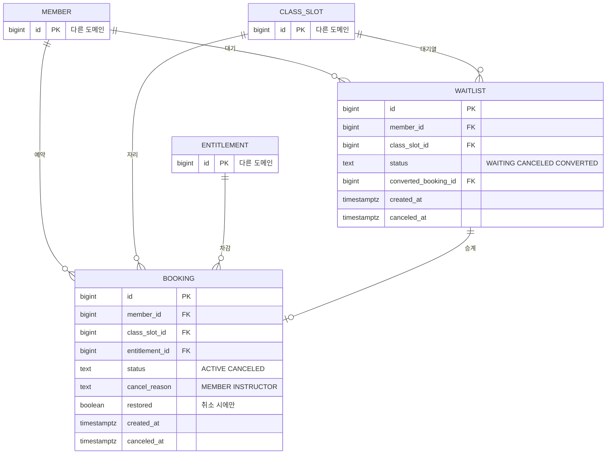

# 예약 도메인 데이터 모델

도메인 사이 관계는 [컨텍스트 맵](../../architecture/context-map.md). 다른 도메인 테이블은 이름과 id만 그렸다.

## ERD



쓰기 흐름(트랜잭션 · 상태 전이)은 [쓰기 경로](write-paths.md)에 있다.

## 테이블

| 테이블 | 도입 기능 |
|---|---|
| `booking` | 0003 |
| `waitlist` | 0004 |

## 주의할 쿼리

### 취소 마감 판정

```sql
-- restorable 판정. 클라이언트 시각은 쓰지 않는다 (PRD 5 AC 2.1.1~2.1.3)
SELECT now() < c.starts_at - (s.cancel_deadline_hours || ' hours')::interval
         AS restorable
  FROM class_slot c
  JOIN recurrence r ON r.id = c.recurrence_id
  JOIN setting    s ON s.instructor_id = r.instructor_id
 WHERE c.id = $1;
```

`setting`이 강사별이므로 `recurrence`를 타고 그 강사의 설정을 찾는다. 강사 A의 회원은 3시간 전까지, 강사 B의 회원은 24시간 전까지가 될 수 있다.

정확히 마감 시각이면 복구 불가다. `<`이지 `<=`가 아니다.

### 대기 순번

```sql
SELECT id, member_id,
       ROW_NUMBER() OVER (PARTITION BY class_slot_id ORDER BY created_at) AS position
  FROM waitlist
 WHERE class_slot_id = $1 AND status = 'WAITING';
```
