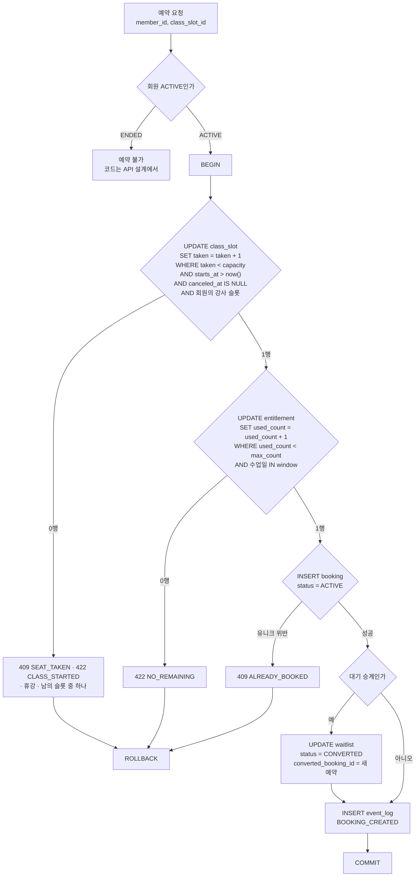
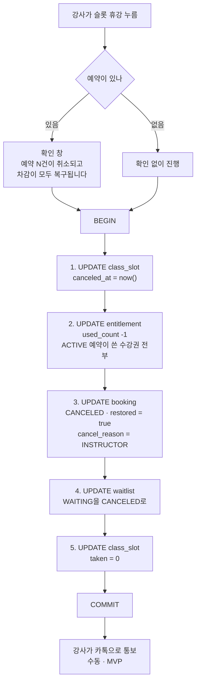
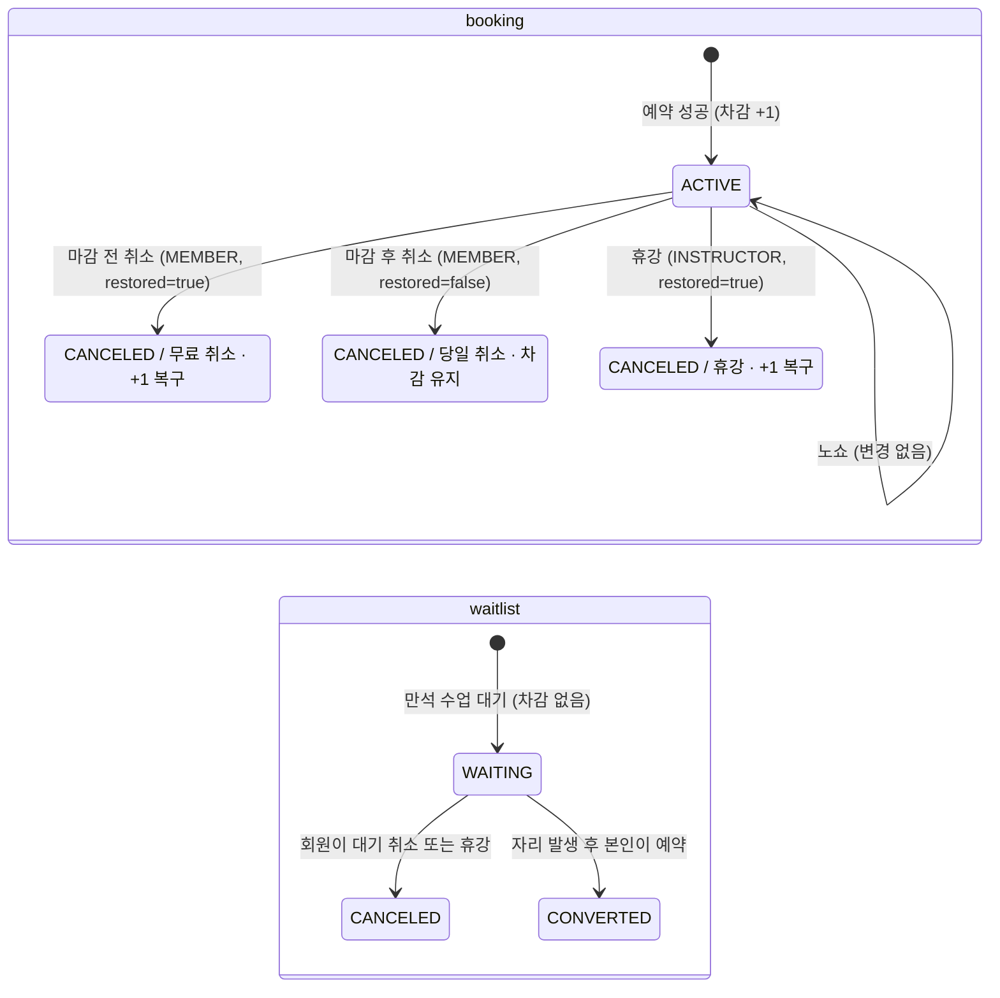

# 예약 도메인 쓰기 경로

> 쓰기 흐름의 **현재 전체 모습**. 기능 PRD는 자기 변경분만 적고 여기로 링크한다. 기능이 머지될 때 doc-sync에서 이 문서를 고치고 변경 이력에 한 줄 추가한다.

**모든 경로의 공통 규칙**

- **`class_slot` 행을 가장 먼저 잠근다.** 예약 · 회원 취소 · 휴강 · 시각 변경이 모두 첫 문장에서 그 슬롯 행을 UPDATE한다. 같은 슬롯을 건드리는 트랜잭션이 이 행에서 한 줄로 서므로, 경로마다 잠그는 순서가 달라 생기는 교착을 막는다
- **소유자 조건을 첫 문장에 넣는다.** 회원 경로는 링크 토큰으로 얻은 회원의 `instructor_id`, 강사 경로는 세션의 `instructor_id`와 슬롯의 `recurrence.instructor_id`가 같아야 한다. `class_slot_id`는 비밀이 아니라 id만 바꿔 남의 슬롯을 건드릴 수 있기 때문이다(PRD 1 AC 1.3)

## 5.1 예약 트랜잭션

> 변경 이력 (구현 전, 설계상 관련 기능): [0003](0003-booking/prd.md) · [0004](0004-waitlist/prd.md)

PRD 3 AC 1.3과 PRD 4 AC 3.2가 같은 트랜잭션이다. 대기 승계도 별도 경로가 아니라 이 흐름에 분기 하나가 붙는다.



```sql
UPDATE class_slot c
   SET taken = taken + 1
  FROM recurrence r
 WHERE c.id = $class_slot_id
   AND r.id = c.recurrence_id
   AND r.instructor_id = $member_instructor_id   -- 링크 토큰으로 얻은 회원의 강사
   AND c.taken < c.capacity
   AND c.starts_at > now()
   AND c.canceled_at IS NULL;
```

0행이면 원인을 가리기 위해 그 슬롯을 한 번 더 읽는다. 없거나 남의 슬롯이면 존재하지 않는 것과 같은 응답, 휴강이면 휴강 응답(코드는 API 설계에서 정한다), 시작했으면 CLASS_STARTED, 나머지는 SEAT_TAKEN이다.

회원 상태가 ENDED면 트랜잭션에 들어가기 전에 거부한다(PRD 1 AC 3.3.2).

핵심은 세 문장 모두 조건을 WHERE에 넣은 단일 UPDATE라는 점이다. "먼저 SELECT로 확인하고 UPDATE"가 아니다. 읽고 쓰는 사이에 다른 요청이 끼어들 틈을 만들지 않으려는 것이고, 조건에 걸리면 영향 행이 0이 되므로 그 값이 곧 에러 코드가 된다.

PostgreSQL 문서 기준으로, 같은 행을 다른 트랜잭션이 수정 중이면 두 번째 UPDATE는 **그 트랜잭션이 끝날 때까지 기다린 뒤 갱신된 행에 대해 WHERE 조건을 다시 평가한다.** 낡은 값으로 판단하고 쓰는 일이 구조적으로 생기지 않는다.

## 5.2 휴강 트랜잭션

> 변경 이력 (구현 전, 설계상 관련 기능): [0003](0003-booking/prd.md) · [0004](0004-waitlist/prd.md)

PRD 3 US 7([DEC-0006](https://github.com/Fit-link-v2/Fit-link-PRD/blob/main/decisions/0006-booking-rules.md))의 트랜잭션이다. 대기 취소(4번 문장)는 기능 0004가 붙인다.

**규칙.** 강사 사정으로 수업이 없어지는 것이므로 회원에게 불이익이 없다. 취소 마감과 무관하게 차감을 전부 복구한다.



```sql
BEGIN;

UPDATE class_slot c SET canceled_at = now()
  FROM recurrence r
 WHERE c.id = $class_slot_id
   AND r.id = c.recurrence_id
   AND r.instructor_id = $me          -- 세션의 강사
   AND c.canceled_at IS NULL;
-- 0행이면 롤백. 남의 슬롯 · 없는 슬롯이면 존재하지 않는 것과 같은 응답,
-- 내 슬롯인데 이미 휴강이면 아무것도 바꾸지 않고 성공으로 끝낸다 (PRD 3 AC 7.2.4)

UPDATE entitlement e SET used_count = e.used_count - 1
  FROM booking b
 WHERE b.class_slot_id = $class_slot_id AND b.status = 'ACTIVE'
   AND e.id = b.entitlement_id;

UPDATE booking
   SET status = 'CANCELED', canceled_at = now(),
       restored = true, cancel_reason = 'INSTRUCTOR'
 WHERE class_slot_id = $class_slot_id AND status = 'ACTIVE';

UPDATE waitlist SET status = 'CANCELED', canceled_at = now()
 WHERE class_slot_id = $class_slot_id AND status = 'WAITING';

UPDATE class_slot SET taken = 0 WHERE id = $class_slot_id;

COMMIT;
```

**잔여를 직접 고친 수강권과 충돌할 수 있다.** 강사가 `used_count`를 0으로 고친 뒤(PRD 3 AC 5.2.1) 그 수강권으로 잡힌 예약이 있는 슬롯을 휴강하면, 2번 문장이 `used_count`를 -1로 만들어 `entitlement_used_range` CHECK에 걸리고 휴강 전체가 롤백된다. 회원 취소도 같다. 수기 수정의 하한을 "ACTIVE 예약 수"로 둘지, 복구를 0에서 멈출지 정해야 한다(BE-0003 열린 질문 Q15).

`taken`을 0으로 되돌리는 이유는 "`taken` = ACTIVE 예약 수"라는 관계를 깨지 않기 위해서다. 휴강된 슬롯은 회원 화면에 나오지 않으므로 값 자체는 쓰이지 않지만, 두 값이 어긋난 채 남으면 나중에 대조할 때 혼란이 된다.

휴강을 `event_log`에 BOOKING_CANCELED로 남길지는 정하지 않았다(BE-0003 열린 질문 Q16).

**개별 슬롯의 시각 변경(PRD 1 AC 2.3.2)은 예약이 있으면 막는다([DEC-0006](https://github.com/Fit-link-v2/Fit-link-PRD/blob/main/decisions/0006-booking-rules.md)).** 회원이 예약한 시각과 실제 시각이 달라지는데, 알림이 범위 밖이라 알릴 방법이 없다. 시각을 바꿔야 하면 휴강 후 새 슬롯을 만든다.

통보는 MVP에서 강사가 카톡으로 한다. PRD 4의 대기 통보와 같은 방식이다.

시각 변경도 조건부 UPDATE 한 문장으로 한다. SELECT로 예약 수를 확인한 뒤 UPDATE하면 그 사이에 예약이 끼어든다.

```sql
UPDATE class_slot c SET starts_at = $new_starts_at
  FROM recurrence r
 WHERE c.id = $class_slot_id AND r.id = c.recurrence_id AND r.instructor_id = $me
   AND c.taken = 0 AND c.canceled_at IS NULL;
-- 0행이면 예약이 있거나 휴강했거나 남의 슬롯
```

## 5.3 회원 취소

> 변경 이력 (구현 전, 설계상 관련 기능): [0003](0003-booking/prd.md) · [0005](0005-cancel-deadline/prd.md)

PRD 3 AC 2.2와 PRD 5 AC 4의 트랜잭션이다. 공통 규칙대로 슬롯 행을 먼저 잠근다.

```sql
BEGIN;

-- 1. 슬롯 잠금 + 자리 반환. 시작 전 · 휴강 아님 · 이 회원의 ACTIVE 예약이 있는 슬롯만
UPDATE class_slot c SET taken = c.taken - 1
  FROM booking b
 WHERE c.id = $class_slot_id AND c.starts_at > now() AND c.canceled_at IS NULL
   AND b.class_slot_id = c.id AND b.member_id = $member_id AND b.status = 'ACTIVE';
-- 0행이면 CLASS_STARTED 또는 취소할 예약 없음. 롤백

-- 2. 예약 취소. restorable은 마감 판정 결과 (PRD 5. 그 전에는 항상 true)
UPDATE booking
   SET status = 'CANCELED', canceled_at = now(),
       cancel_reason = 'MEMBER', restored = $restorable
 WHERE class_slot_id = $class_slot_id AND member_id = $member_id AND status = 'ACTIVE'
RETURNING entitlement_id;

-- 3. 복구 가능할 때만 차감을 돌려준다
UPDATE entitlement SET used_count = used_count - 1
 WHERE id = $entitlement_id AND $restorable;

INSERT INTO event_log (type, member_id, class_slot_id) VALUES ('BOOKING_CANCELED', $member_id, $class_slot_id);

COMMIT;
```

마감 판정 쿼리는 [데이터 모델](data-model.md)의 "취소 마감 판정"에 있다. 판정은 1번 문장 뒤, 같은 트랜잭션 안에서 한다.

## 5.4 상태 전이

> 변경 이력 (구현 전, 설계상 관련 기능): [0003](0003-booking/prd.md) · [0004](0004-waitlist/prd.md) · [0005](0005-cancel-deadline/prd.md)



회원 취소는 마감 판정 결과에 따라 복구 여부가 갈린다. 휴강은 언제든 복구한다. 노쇼는 상태가 바뀌지 않는다.
