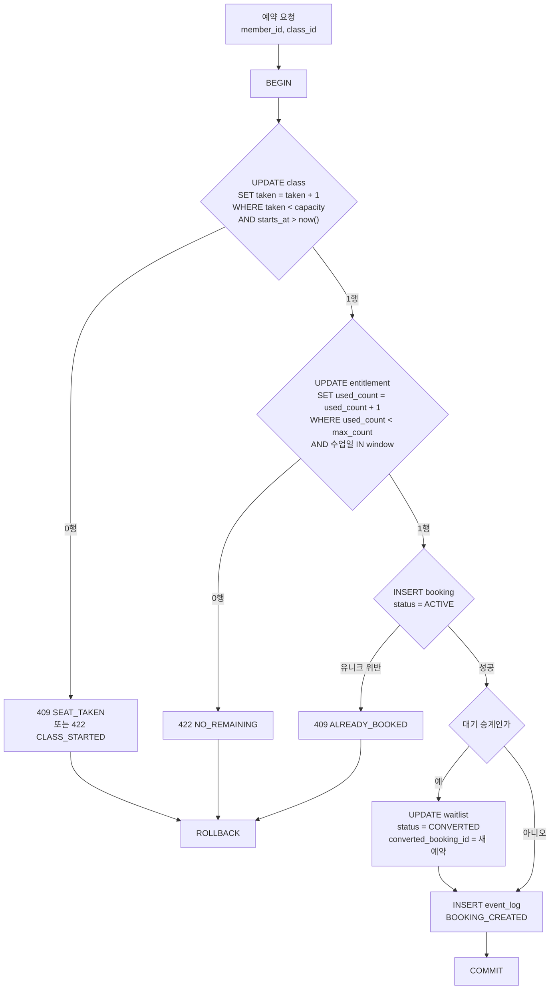
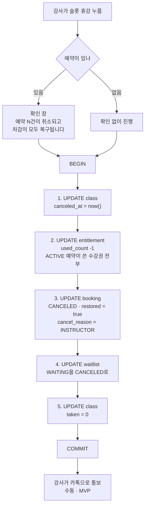
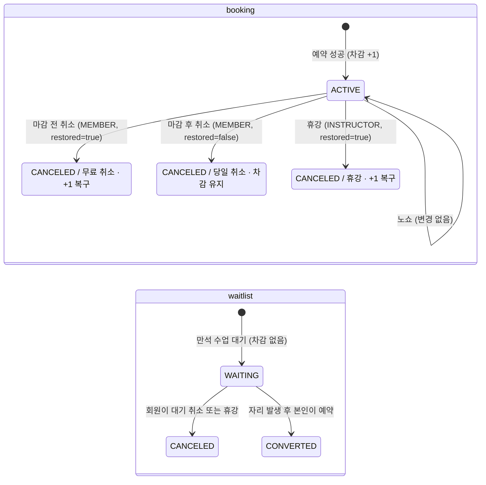

# 예약 도메인 쓰기 경로

> 쓰기 흐름의 **현재 전체 모습**. 기능 PRD는 자기 변경분만 적고 여기로 링크한다. 기능이 머지될 때 doc-sync에서 이 문서를 고치고 변경 이력에 한 줄 추가한다.

## 5.1 예약 트랜잭션

> 변경 이력 (구현 전, 설계상 관련 기능): [0003](0003-booking/prd.md) · [0004](0004-waitlist/prd.md)

PRD 3 AC 1.3과 PRD 4 AC 3.2가 같은 트랜잭션이다. 대기 승계도 별도 경로가 아니라 이 흐름에 분기 하나가 붙는다.



핵심은 세 문장 모두 조건을 WHERE에 넣은 단일 UPDATE라는 점이다. "먼저 SELECT로 확인하고 UPDATE"가 아니다. 읽고 쓰는 사이에 다른 요청이 끼어들 틈을 만들지 않으려는 것이고, 조건에 걸리면 영향 행이 0이 되므로 그 값이 곧 에러 코드가 된다.

PostgreSQL 문서 기준으로, 같은 행을 다른 트랜잭션이 수정 중이면 두 번째 UPDATE는 **그 트랜잭션이 끝날 때까지 기다린 뒤 갱신된 행에 대해 WHERE 조건을 다시 평가한다.** 낡은 값으로 판단하고 쓰는 일이 구조적으로 생기지 않는다.

## 5.2 휴강 트랜잭션

> 변경 이력 (구현 전, 설계상 관련 기능): [0003](0003-booking/prd.md) · [0004](0004-waitlist/prd.md)

PRD 1 AC 2.3.1이 "예약 처리 규칙은 PRD 3에서 정의한다"고 했으나 PRD 3에 없다. 여기서 정의한다.

**규칙.** 강사 사정으로 수업이 없어지는 것이므로 회원에게 불이익이 없다. 취소 마감과 무관하게 차감을 전부 복구한다.



```sql
BEGIN;

UPDATE class SET canceled_at = now()
 WHERE id = $class_id AND canceled_at IS NULL;
-- 0행이면 이미 휴강. 롤백하고 종료

UPDATE entitlement e SET used_count = e.used_count - 1
  FROM booking b
 WHERE b.class_id = $class_id AND b.status = 'ACTIVE'
   AND e.id = b.entitlement_id;

UPDATE booking
   SET status = 'CANCELED', canceled_at = now(),
       restored = true, cancel_reason = 'INSTRUCTOR'
 WHERE class_id = $class_id AND status = 'ACTIVE';

UPDATE waitlist SET status = 'CANCELED', canceled_at = now()
 WHERE class_id = $class_id AND status = 'WAITING';

UPDATE class SET taken = 0 WHERE id = $class_id;

COMMIT;
```

`taken`을 0으로 되돌리는 이유는 "`taken` = ACTIVE 예약 수"라는 관계를 깨지 않기 위해서다. 휴강된 슬롯은 회원 화면에 나오지 않으므로 값 자체는 쓰이지 않지만, 두 값이 어긋난 채 남으면 나중에 대조할 때 혼란이 된다.

**개별 슬롯의 시각 변경(AC 2.3.2)은 예약이 있으면 막는다.** 회원이 예약한 시각과 실제 시각이 달라지는데, 알림이 범위 밖이라 알릴 방법이 없다. 시각을 바꿔야 하면 휴강 후 새 슬롯을 만든다.

통보는 MVP에서 강사가 카톡으로 한다. PRD 4의 대기 통보와 같은 방식이다.

## 5.3 상태 전이

> 변경 이력 (구현 전, 설계상 관련 기능): [0003](0003-booking/prd.md) · [0004](0004-waitlist/prd.md) · [0005](0005-cancel-deadline/prd.md)



회원 취소는 마감 판정 결과에 따라 복구 여부가 갈린다. 휴강은 언제든 복구한다. 노쇼는 상태가 바뀌지 않는다.
