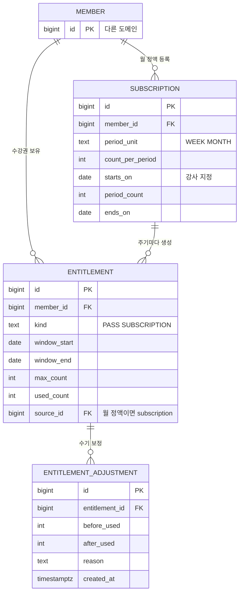

# 수강권 도메인 데이터 모델

도메인 사이 관계는 [컨텍스트 맵](../../architecture/context-map.md). 다른 도메인 테이블은 이름과 id만 그렸다.

## ERD



쓰기 흐름(등록 · 주기별 생성)은 [쓰기 경로](write-paths.md)에 있다.

## 테이블

| 테이블 | 도입 기능 |
|---|---|
| `entitlement` | 0001 |
| `entitlement_adjustment` | 0003 |
| `subscription` | 0001 |

## 주의할 쿼리

### 수강권 window 비교

`entitlement.window_start/end`는 `date`인데 `class_slot.starts_at`은 `timestamptz`다. 그냥 비교하면 DB 세션 타임존에 따라 자정 근처 수업의 판정이 흔들린다.

```sql
-- 세션 타임존에 기대지 않고 명시적으로 변환한다
(c.starts_at AT TIME ZONE 'Asia/Seoul')::date
  BETWEEN e.window_start AND e.window_end
```
