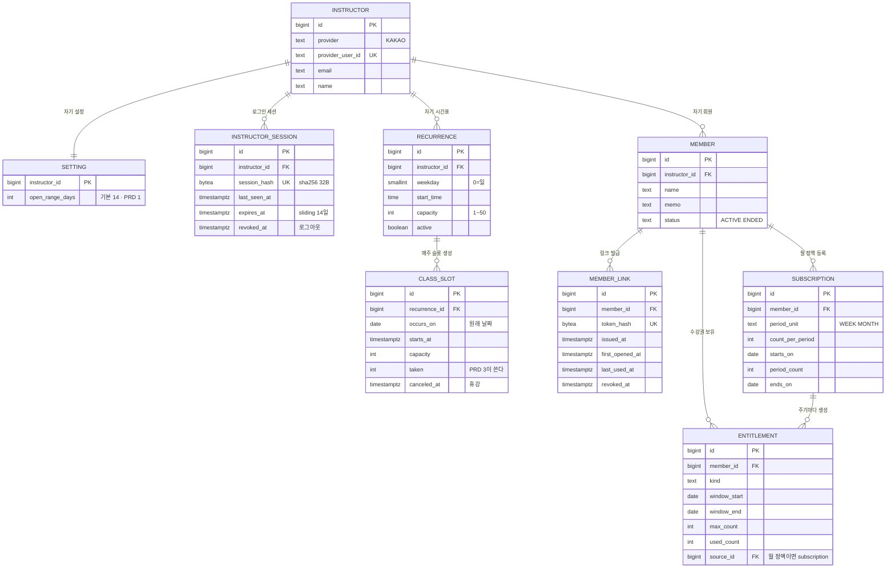

# BE-0001 개발 PRD · 강사 세팅

> Notion "테이블 설계 · ERD" 문서에서 이 기능에 해당하는 부분을 옮긴 뒤, 2026-09-25 회의 결정([DEC-0001~0006](https://github.com/Fit-link-v2/Fit-link-PRD/tree/main/decisions))을 반영했다. 아직 recatch-tdd prd 단계 전이다. [템플릿](../../../templates/prd.md) 형식(인수 조건 · API 절)으로 다시 쓰는 것은 이 기능의 prd 단계에서 한다.

## 근거

- 제품 PRD: [PRD-0001](https://github.com/Fit-link-v2/Fit-link-PRD/tree/main/prd/0001-instructor-setup)

## 기술 설계

### 이 기능이 만드는 범위

PRD 1 단계에서 실제로 `CREATE TABLE`하는 것은 이 9개다. `booking` · `waitlist` · `event_log` · `entitlement_adjustment`는 PRD 3 이후에 붙는다.



| 컬럼 | PRD 1이 쓰나 | 지금 넣는 이유 |
|---|---|---|
| `class_slot.taken` | **아니오** | PRD 3 AC 1.3.1의 조건부 UPDATE 대상. 나중에 넣으려면 이미 생성된 슬롯 전부를 backfill해야 한다 |
| `entitlement.used_count` | 예 | AC 3.2.3의 "잔여 = max_count - used_count"와 강사의 수기 수정에 쓴다 |
| `member_link.revoked_at` | 예 | AC 4.3.1 재발급 |
| `class_slot.canceled_at` | 예 (쓰기) | AC 2.3.1 휴강. 읽는 쪽은 PRD 2다 |

표에서 첫 줄 하나만 "PRD 1이 안 쓰는" 컬럼이다. 그리고 그 하나가 **PRD 1의 인수 조건만으로는 도출되지 않는다.**

AC 2.1.1은 `capacity`(정원 상한)를 요구하지만 `taken`(현재 찬 인원)을 요구하지 않는다. PRD 1 범위에는 `booking`이 없어 자리를 차지하는 쓰기 경로 자체가 없고, 따라서 경쟁도 없다. `taken`이 필요해지는 근거는 **"예약이라는 쓰기 경로가 생긴다"**는 사실이고, 그것은 PRD 0(상위 구상)에 있다.

정리하면 이렇다. 세부 인수 조건(PRD 3~5)이 없어도 상위 구상만 있으면 `taken`은 나온다. 그러나 **PRD 1만으로는 나오지 않는다.** 그 상태에서 설계하면 "예약 인원은 `booking`을 COUNT하면 되니 `taken`은 필요 없다"로 가게 되고, 정원 조건부 UPDATE를 쓸 수 없게 된다.

반대로 `booking.restored`(PRD 3 휴강 · PRD 5 마감)처럼 **PRD 1 시점에 알 수도 없고 나중에 넣으면 비싼** 항목도 남는다. 스키마를 앞 단계 문서만으로 전부 확정할 수는 없다는 뜻이다. 이 문서가 PRD 1~5를 한 번에 읽고 작성된 이유다.

팀원과 공유할 때는 전체 그림과 이 절을 같이 본다. 전체 그림은 "최종적으로 여기로 간다", 이 절은 "이번 단계에 손대는 범위"를 말한다.

### 테이블 정의 (DDL)

#### 1. 강사 · 설정

```sql
CREATE TABLE instructor (
  id               bigserial   PRIMARY KEY,
  provider         text        NOT NULL CHECK (provider IN ('KAKAO')),
  provider_user_id text        NOT NULL,
  email            text,       -- 카카오 필수 동의로 받는다. 비즈 앱 전환 전에는 비어 있을 수 있다
  name             text,
  created_at       timestamptz NOT NULL DEFAULT now(),

  CONSTRAINT instructor_identity_uk UNIQUE (provider, provider_user_id)
);

-- 강사마다 1행. PK가 곧 소유자다.
CREATE TABLE setting (
  instructor_id         bigint      PRIMARY KEY REFERENCES instructor(id),
  open_range_days       int         NOT NULL DEFAULT 14
                          CHECK (open_range_days BETWEEN 7 AND 28),
  updated_at            timestamptz NOT NULL DEFAULT now()
);
```

비밀번호를 담는 컬럼이 없다. 카카오가 인증을 끝내고 우리는 `(provider, provider_user_id)`만 받는다([DEC-0001](https://github.com/Fit-link-v2/Fit-link-PRD/blob/main/decisions/0001-instructor-kakao-oauth.md)). 유출 시 비밀번호가 새지 않고, 재설정 화면도 필요 없다. `provider` CHECK는 지금 `KAKAO` 하나다. 다른 로그인 수단을 붙이면 CHECK 값만 늘린다.

`instructor_identity_uk`가 PRD 1 AC 1.2.3("같은 카카오 계정으로 다시 로그인하면 새로 가입되지 않는다")의 물리적 표현이다. 가입은 `INSERT ... ON CONFLICT (provider, provider_user_id) DO NOTHING` 뒤 조회로 처리하면 동시에 두 번 눌러도 강사가 두 명 생기지 않는다.

`cancel_deadline_hours`(취소 마감)는 기능 0005의 마이그레이션 004에서 붙는다.

`setting`의 PK가 `instructor_id`이므로 강사당 정확히 1행이 강제된다. 가입과 같은 트랜잭션에서 기본값으로 1행을 만든다(PRD 1 AC 1.2.2).

#### 1-1. 로그인 세션

```sql
-- 강사 로그인 세션 (DEC-0002). 세션 ID 원본은 쿠키에만 있고 DB에는 해시만 남는다.
CREATE TABLE instructor_session (
  id            bigserial   PRIMARY KEY,
  instructor_id bigint      NOT NULL REFERENCES instructor(id),
  session_hash  bytea       NOT NULL UNIQUE,   -- SHA-256, 32바이트
  created_at    timestamptz NOT NULL DEFAULT now(),
  last_seen_at  timestamptz NOT NULL DEFAULT now(),
  expires_at    timestamptz NOT NULL,          -- last_seen_at + 14일
  revoked_at    timestamptz                    -- 로그아웃
);

CREATE INDEX instructor_session_owner_idx ON instructor_session (instructor_id);
```

```sql
-- 요청마다: 유효한 세션인지 확인하면서 만료를 연장한다 (PRD 1 AC 1.1.6)
UPDATE instructor_session
   SET last_seen_at = now(), expires_at = now() + interval '14 days'
 WHERE session_hash = $hash AND revoked_at IS NULL AND expires_at > now()
RETURNING instructor_id;
-- 0행이면 로그인 화면으로

-- 로그아웃 (PRD 1 AC 1.1.7)
UPDATE instructor_session SET revoked_at = now()
 WHERE session_hash = $hash AND revoked_at IS NULL;
```

세션 ID 원본을 저장하지 않는 이유는 `member_link`와 같다. DB가 유출돼도 살아 있는 세션을 가져갈 수 없다([DEC-0002](https://github.com/Fit-link-v2/Fit-link-PRD/blob/main/decisions/0002-instructor-session-cookie.md)).

만료를 요청마다 연장하면 요청마다 쓰기가 한 번 생긴다. 강사 수십 명 규모에서는 문제되지 않는다. 부담이 되면 `last_seen_at`이 일정 시간 이상 지났을 때만 갱신한다. 만료되거나 로그아웃한 행은 주기적으로 지운다. 세션은 이력이 아니라 보안 자료라 BE-ADR-0003(지우지 않는다)의 예외다.

이 테이블을 직접 만들지, Spring Session JDBC를 쓸지는 [BE-ADR-0008](../../../decisions/0008-session-store.md)에서 다룬다. Spring Session JDBC의 기본 스키마는 세션 ID를 원본으로 저장한다.

#### 2. 시간표

```sql
CREATE TABLE recurrence (
  id            bigserial   PRIMARY KEY,
  instructor_id bigint      NOT NULL REFERENCES instructor(id),
  weekday       smallint    NOT NULL CHECK (weekday BETWEEN 0 AND 6),  -- 0=일
  start_time    time        NOT NULL,
  capacity      int         NOT NULL CHECK (capacity BETWEEN 1 AND 50),
  active        boolean     NOT NULL DEFAULT true,
  created_at    timestamptz NOT NULL DEFAULT now()
);

CREATE INDEX recurrence_owner_idx ON recurrence (instructor_id);

-- 같은 강사가 같은 요일 · 같은 시각에 규칙을 두 개 두지 못한다.
CREATE UNIQUE INDEX recurrence_slot_uidx
  ON recurrence (instructor_id, weekday, start_time) WHERE active;

CREATE TABLE class_slot (
  id            bigserial   PRIMARY KEY,
  recurrence_id bigint      NOT NULL REFERENCES recurrence(id),
  occurs_on     date        NOT NULL,   -- 반복 규칙이 만든 원래 날짜. 시각을 바꿔도 그대로
  starts_at     timestamptz NOT NULL,
  capacity      int         NOT NULL CHECK (capacity >= 0),
  taken         int         NOT NULL DEFAULT 0,
  canceled_at   timestamptz,
  created_at    timestamptz NOT NULL DEFAULT now(),

  CONSTRAINT class_slot_occurrence_uk UNIQUE (recurrence_id, occurs_on),
  CONSTRAINT class_slot_taken_range CHECK (taken >= 0 AND taken <= capacity)
);

-- 회원 화면은 항상 "휴강 아닌 슬롯을 시각순으로" 읽는다.
CREATE INDEX class_slot_open_starts_at_idx
  ON class_slot (starts_at) WHERE canceled_at IS NULL;
```

`class_slot.capacity`는 생성 시점에 `recurrence.capacity`를 복사한다. 반복 규칙의 정원을 나중에 바꿔도 이미 생성된 슬롯은 흔들리지 않는다. 복사하지 않고 참조하면 "그때 정원이 몇이었나"를 영원히 복원할 수 없다.

`class_slot_taken_range`는 예약 트랜잭션의 조건부 UPDATE가 뚫렸을 때를 막는 마지막 방어선이다. 애플리케이션 버그로 정원을 넘기는 UPDATE가 들어오면 DB가 거부한다.

**슬롯 생성의 중복 방지 키는 `(recurrence_id, occurs_on)`이다.** `starts_at`으로 걸면 강사가 개별 슬롯의 시각을 바꾼 뒤(PRD 1 AC 2.3.2) 다음 배치가 "원래 시각 슬롯이 없다"고 보고 다시 만든다. 그러면 AC 2.3.3(변경은 그 슬롯에만)과 AC 2.2.2(여러 번 돌려도 결과 같음)가 깨진다. 원래 날짜를 따로 저장하고 그것으로 중복을 막으면 시각을 바꿔도 배치가 같은 회차를 다시 만들지 않는다. 휴강은 행을 지우지 않으므로(`canceled_at`) 역시 다시 만들어지지 않는다.

반복 주기는 매주로 고정돼 있다. 격주 · 월 n번째 주는 PRD 1의 범위 밖이다(인터뷰 7번). 넣게 되면 `recurrence`에 `interval_weeks`와 `anchor_date` 두 컬럼이 붙는다. 기존 행은 각각 1과 생성일로 채우면 되므로 나중에 넣어도 비용이 낮다.

#### 3. 회원 · 링크

```sql
CREATE TABLE member (
  id            bigserial   PRIMARY KEY,
  instructor_id bigint      NOT NULL REFERENCES instructor(id),
  name          text        NOT NULL,
  memo          text,
  status        text        NOT NULL DEFAULT 'ACTIVE'
                  CHECK (status IN ('ACTIVE', 'ENDED')),
  created_at    timestamptz NOT NULL DEFAULT now()
);
-- name에 UNIQUE를 걸지 않는다. 동명이인 허용이 인수 조건이다 (PRD 1 AC 3.1.2).

CREATE INDEX member_owner_idx ON member (instructor_id, status);

CREATE TABLE member_link (
  id              bigserial   PRIMARY KEY,
  member_id       bigint      NOT NULL REFERENCES member(id),
  token_hash      bytea       NOT NULL UNIQUE,   -- SHA-256, 32바이트
  issued_at       timestamptz NOT NULL DEFAULT now(),
  first_opened_at timestamptz,
  last_used_at    timestamptz,
  revoked_at      timestamptz
);

-- 회원 1명에게 살아 있는 링크는 최대 1개.
CREATE UNIQUE INDEX member_link_active_uidx
  ON member_link (member_id) WHERE revoked_at IS NULL;
```

토큰 원본을 담는 컬럼이 없다. 이것이 PRD 1 AC 4.1.2의 물리적 표현이다. 원본은 발급 응답에만 실려 나가고 DB에는 남지 않는다.

`token_hash`가 **전역 UNIQUE**다. 강사가 몇 명이든 토큰은 16바이트 난수라 충돌하지 않는다. 토큰 하나가 회원 한 명을 가리키고, 그 회원의 `instructor_id`가 어느 강사의 시간표를 보여줄지 결정한다. 회원 쪽 격리는 이것으로 자동 성립한다.

재발급은 기존 행에 `revoked_at`을 찍고 새 행을 넣는다. 새 행의 `first_opened_at`은 자연히 NULL이므로 AC 5.1.3의 "재발급하면 초기화"가 별도 로직 없이 성립한다. 죽은 행은 부분 유니크 인덱스의 조건을 만족하지 않아 인덱스에 들어가지 않으므로, 재발급이 쌓여도 조회가 느려지지 않는다.

#### 4. 수강권

`entitlement.source_id`가 `subscription`을 가리키므로 `subscription`을 먼저 만든다. 설명은 5절.

```sql
-- 월 정액 등록 1건 (DEC-0004). 차감 대상이 아니라 주기별 entitlement를 만들어내는 설정이다.
CREATE TABLE subscription (
  id               bigserial   PRIMARY KEY,
  member_id        bigint      NOT NULL REFERENCES member(id),
  period_unit      text        NOT NULL CHECK (period_unit IN ('WEEK', 'MONTH')),
  count_per_period int         NOT NULL CHECK (count_per_period > 0),
  starts_on        date        NOT NULL,   -- 강사가 지정한 시작일. 주기는 여기서부터 센다
  period_count     int         NOT NULL CHECK (period_count > 0),   -- 4주, 3개월
  ends_on          date        NOT NULL,   -- 마지막 주기의 마지막 날. 등록할 때 계산해 저장
  created_at       timestamptz NOT NULL DEFAULT now(),

  CONSTRAINT subscription_range_order CHECK (starts_on <= ends_on),
  -- 주 단위는 종료일이 시작일과 주기 수로 정해진다. 월 단위는 Q12가 정해지면 같은 CHECK를 붙인다
  CONSTRAINT subscription_week_end
    CHECK (period_unit <> 'WEEK' OR ends_on = starts_on + 7 * period_count - 1)
);

CREATE INDEX subscription_member_idx ON subscription (member_id);

CREATE TABLE entitlement (
  id           bigserial   PRIMARY KEY,
  member_id    bigint      NOT NULL REFERENCES member(id),
  kind         text        NOT NULL CHECK (kind IN ('PASS', 'SUBSCRIPTION')),
  window_start date        NOT NULL,
  window_end   date        NOT NULL,
  max_count    int         NOT NULL CHECK (max_count > 0),
  used_count   int         NOT NULL DEFAULT 0,
  source_id    bigint      REFERENCES subscription(id),   -- 월 정액이면 그 등록, 횟수권이면 NULL
  created_at   timestamptz NOT NULL DEFAULT now(),

  CONSTRAINT entitlement_window_order CHECK (window_start <= window_end),
  CONSTRAINT entitlement_used_range
    CHECK (used_count >= 0 AND used_count <= max_count),
  CONSTRAINT entitlement_source_shape
    CHECK ((kind = 'SUBSCRIPTION') = (source_id IS NOT NULL))
);

-- 예약 시 "유효한 것 중 만료가 가장 이른 1장"을 고른다 (PRD 3 AC 1.3.5).
CREATE INDEX entitlement_pick_idx ON entitlement (member_id, window_end);
```

횟수권과 월 정액의 차이는 컬럼이 아니라 행의 수명이다. 횟수권은 구매 1건에 행 1개이고 `window`가 유효 기간 전체다. 월 정액은 주기마다 행이 새로 생기고 `window`가 그 주기다. 예약 · 차감 쿼리는 양쪽에서 완전히 같다.

`entitlement_used_range`가 PRD 3 AC 5.2.1의 "0 이상 `max_count` 이하"를 그대로 담는다. 강사의 수기 수정도 이 범위를 벗어날 수 없다.

#### 5. 월 정액

`subscription` 테이블은 4절에 있다. 여기에는 `entitlement`에 거는 인덱스와 제약을 둔다.

```sql
-- 같은 월 정액의 같은 주기는 한 번만 만든다. 배치를 여러 번 돌려도 결과가 같다.
CREATE UNIQUE INDEX entitlement_period_uidx
  ON entitlement (source_id, window_start) WHERE source_id IS NOT NULL;

-- 한 회원이 다른 종류의 수강권을 기간이 겹치게 가질 수 없다 (PRD 1 AC 3.2.10).
-- 같은 종류끼리는 겹쳐도 된다 (AC 3.2.11). <> 비교에는 btree_gist 확장이 필요하다.
CREATE EXTENSION IF NOT EXISTS btree_gist;

ALTER TABLE entitlement ADD CONSTRAINT entitlement_kind_no_overlap
  EXCLUDE USING gist (
    member_id WITH =,
    kind WITH <>,
    (daterange(window_start, window_end, '[]')) WITH &&
  );
```

횟수권과 월 정액을 한 테이블로 합친 결정(PRD 0)은 그대로다. 합친 것은 **차감 모델**이고, 월 정액 등록 정보는 차감 대상이 아니라 행을 만들어내는 설정이다. 그래서 `entitlement`에 섞지 않고 `subscription`으로 뺐다. 같은 테이블에 두면 PRD 3 AC 1.3.5의 "유효한 것 중 만료가 가장 이른 1장"에 등록 정보 행도 걸려 거기서 차감될 수 있다.

`entitlement_source_shape`가 "월 정액 행은 반드시 등록을 가리키고, 횟수권 행은 아무것도 가리키지 않는다"를 강제한다.

**주기 계산.** 주기는 `starts_on`부터 센다(PRD 1 AC 3.2.7). 주 단위면 7일씩, 월 단위면 한 달씩이다. `ends_on`은 등록할 때 마지막 주기의 끝으로 계산해 저장한다. 월 단위에서 시작일이 29~31일일 때 짧은 달을 어떻게 셀지는 정하지 않았다(열린 질문 Q12).

**주기별 수강권 생성.** 등록할 때와 매일 1회 배치에서 같은 쿼리를 돈다. 오픈 범위 안의 수업을 예약할 수 있어야 하므로, 오늘부터 그 강사의 오픈 범위 끝까지에 걸치는 주기를 미리 만든다(AC 3.2.8). `ends_on`을 넘는 주기는 만들지 않는다(AC 3.2.9). `entitlement_period_uidx`와 `INSERT ... ON CONFLICT DO NOTHING`으로 몇 번을 돌려도 중복이 생기지 않는다. 절차는 [수강권 쓰기 경로](../../entitlement/write-paths.md)에 있다.

**종류 겹침 검사의 한계.** `entitlement_kind_no_overlap`은 이미 만들어진 행끼리만 비교한다. 월 정액의 뒤쪽 주기는 아직 행이 없으므로, 그 기간에 횟수권을 등록하면 DB가 막지 못하고 나중에 배치의 INSERT가 실패한다. 그래서 등록할 때 애플리케이션이 `subscription.starts_on ~ ends_on` 전체 기간과 비교한다. 제약은 그 검사가 뚫렸을 때의 마지막 방어선이다. 결정 근거는 [BE-ADR-0009](../../../decisions/0009-entitlement-kind-exclusion.md).

### 마이그레이션

PRD 단위가 배포 단위는 아니다. 1차 배포에는 PRD 1~3이 함께 나간다.

| 마이그레이션 | 내용 | 시점 |
|---|---|---|
| 001 | btree_gist 확장, instructor, instructor_session, setting(open_range_days), recurrence, class_slot, member, member_link, subscription, entitlement | PRD 1 |

## AC 대 제약

인수 조건이 어느 제약으로 내려왔는지의 대응표다. 리뷰는 이 표를 기준으로 하면 된다.

| PRD · AC | 요구 | 물리 제약 |
|---|---|---|
| (제품 형태) | 강사끼리 데이터가 섞이지 않음 | `member.instructor_id`, `recurrence.instructor_id`, `setting` PK |
| 1 · AC 2.1.1 | 정원 1 이상 50 이하 | `recurrence` CHECK capacity BETWEEN 1 AND 50 |
| 1 · AC 1.1.6 | 세션 2주, 요청마다 연장 | `instructor_session.expires_at` 조건부 UPDATE |
| 1 · AC 1.1.7 | 로그아웃 즉시 무효 | `instructor_session.revoked_at` |
| 1 · AC 1.2.2 | 가입 시 설정 1행 | `setting` PK = instructor_id. 가입 트랜잭션에서 INSERT |
| 1 · AC 1.2.3 | 같은 카카오 계정은 한 번만 가입 | `instructor_identity_uk` (provider, provider_user_id) |
| 1 · AC 1.3.1 | 강사는 자기 데이터만 | `member.instructor_id`, `recurrence.instructor_id`. 모든 강사 화면 쿼리에 소유자 조건 |
| 1 · AC 2.1.3 | 같은 규칙 재저장해도 슬롯 중복 없음 | `class_slot` UNIQUE (recurrence_id, occurs_on) |
| 1 · AC 2.2.2 | 배치를 여러 번 돌려도 결과 동일 | 위 유니크 + INSERT ... ON CONFLICT DO NOTHING |
| 1 · AC 2.3.1 | 휴강. 예약이 있으면 확인 창 | `class_slot.canceled_at` + `booking.cancel_reason` (처리는 write-paths 5.2) |
| 1 · AC 2.3.2 | 예약이 있는 슬롯은 시각 변경 불가 | 조건부 UPDATE `WHERE taken = 0` ([쓰기 경로](../../booking/write-paths.md)) |
| 1 · AC 2.3.3 | 삭제 · 변경은 해당 슬롯에만 | `recurrence`와 `class_slot`을 분리. 규칙은 안 건드린다 |
| 1 · AC 2.4.1 | 오픈 범위 7~28일 | `setting` CHECK open_range_days BETWEEN 7 AND 28 |
| 1 · AC 3.1.2 | 동명이인 허용 | `member.name`에 UNIQUE 없음 (의도적 부재) |
| 1 · AC 3.2.3 · 3 · AC 5.2.1 | 잔여는 0 이상 max_count 이하 | `entitlement` CHECK used_count 범위 |
| 1 · AC 3.2.6 | 월 정액 입력값 | `subscription` CHECK period_unit · count_per_period · period_count |
| 1 · AC 3.2.8 | 주기별 수강권 자동 생성, 중복 없음 | `entitlement_period_uidx` (source_id, window_start) |
| 1 · AC 3.2.9 | 마지막 주기 뒤로는 만들지 않음 | 생성 쿼리의 `generate_series(0, period_count - 1)` |
| 1 · AC 3.2.10 | 다른 종류 기간 겹침 금지 | `entitlement_kind_no_overlap` EXCLUDE + 등록 시 애플리케이션 검사 |
| 1 · AC 3.2.11 | 같은 종류는 겹쳐도 됨 | 위 EXCLUDE가 `kind WITH <>`라 같은 종류는 비교하지 않음 |
| 1 · AC 3.3.1 | 수강 종료는 삭제가 아님 | `member.status` ENDED. DELETE 경로 없음 |
| 1 · AC 4.1.2 | 해시만 저장 | `member_link`에 원본 토큰 컬럼 없음 |
| 1 · AC 4.3.1 | 재발급 시 이전 링크 무효 | `revoked_at` · member당 유효 링크 1개 부분 유니크 |
| 1 · AC 4.3.2 | 재발급해도 예약 기록 유지 | `booking.member_id`가 링크가 아닌 회원을 참조 |
| 1 · AC 5.1.3 | 재발급 시 최초 접속 초기화 | 새 행의 first_opened_at이 NULL. 별도 로직 불필요 |

"의도적 부재" 세 줄이 리뷰에서 가장 놓치기 쉬운 부분이다. 컬럼이 없는 것이 설계 누락이 아니라 인수 조건이다.

## 열린 질문

| # | 질문 | 영향 |
|---|---|---|
| ~~Q1~~ | ~~`class` 테이블을 `class_slot`으로 개명할 것인가~~ | **해소.** `class_slot`으로 개명([BE-ADR-0007](../../../decisions/0007-class-slot-naming.md)) |
| ~~Q2~~ | ~~같은 요일 · 시각의 규칙 2개 허용~~ | **해소.** `recurrence (instructor_id, weekday, start_time) WHERE active` 부분 유니크로 금지 |
| ~~Q3~~ | ~~`recurrence.capacity`를 바꾸면 이미 생성된 슬롯은~~ | **해소.** 안 바뀐다. 생성 시점 복사를 유지([BE-ADR-0005](../../../decisions/0005-snapshot-capacity.md)) |
| ~~Q4~~ | ~~타임존을 상수로 박을 것인가~~ | **해소.** `Asia/Seoul` 상수. 국내 강사만 받는 동안 유지([BE-ADR-0006](../../../decisions/0006-time-and-timezone.md)) |
| ~~Q5~~ | ~~`entitlement.kind`를 어느 쪽으로 둘 것인가~~ | **해소.** 둘 다 지원([DEC-0004](https://github.com/Fit-link-v2/Fit-link-PRD/blob/main/decisions/0004-entitlement-pass-and-subscription.md)). `subscription` 테이블과 주기 배치가 이 기능에 들어왔다 |
| Q7 | PK를 bigserial로 둘 것인가 | 강사당 회원 15~20명 규모면 충분하다. `class_slot_id`는 URL에 노출되지만 비밀이 아니다. 비밀인 것은 `member_link.token_hash` 하나뿐이고 그것만 난수다 |
| ~~Q8~~ | ~~OAuth provider를 무엇으로 할 것인가~~ | **해소.** 카카오([DEC-0001](https://github.com/Fit-link-v2/Fit-link-PRD/blob/main/decisions/0001-instructor-kakao-oauth.md)). CHECK는 `KAKAO` 하나 |
| ~~Q9~~ | ~~가입을 열어둘 것인가~~ | **해소.** 개방([DEC-0001](https://github.com/Fit-link-v2/Fit-link-PRD/blob/main/decisions/0001-instructor-kakao-oauth.md)) |
| Q10 | 휴강 통보를 어떻게 할 것인가 | 강사가 카톡으로 한다([DEC-0006](https://github.com/Fit-link-v2/Fit-link-PRD/blob/main/decisions/0006-booking-rules.md)). 회원이 링크를 열기 전까지 모른다. 자동 알림은 PRD 0에서 범위 밖 |
| Q11 | 세션 저장을 직접 만들지, Spring Session JDBC를 쓸지 | [BE-ADR-0008](../../../decisions/0008-session-store.md) (proposed) |
| Q12 | 월 단위 주기에서 시작일이 29~31일이면 짧은 달을 어떻게 세나 | `ends_on`과 주기별 `window_start`·`window_end` 계산이 달라진다. PRD 1 열린 질문과 같다 |
| Q13 | 월 정액을 중간에 끝내면 | 남은 주기, 이미 만든 수강권, 그 수강권으로 잡은 예약을 어떻게 할지. 정하기 전까지 `subscription`에는 종료 컬럼을 두지 않는다 |
| Q14 | 카카오 이메일을 못 받으면 | 비즈 앱 전환이 막히면 `instructor.email`이 계속 비어 있다. 스키마는 이미 NULL을 허용한다 |
| Q17 | 슬롯 생성 배치의 SQL과 타임존 변환 | `recurrence × 날짜 → class_slot`의 SQL이 아직 없다. `occurs_on + start_time`을 `Asia/Seoul` 기준 `timestamptz`로 바꾸는 방법과 함께 이 기능의 prd 단계에서 쓴다 |
| Q18 | 규칙을 끄고 같은 요일 · 시각으로 새 규칙을 만들면 | 부분 유니크가 `WHERE active`라 허용되고, 끈 규칙의 남은 슬롯과 새 규칙의 슬롯이 같은 시각에 둘 다 생긴다. 끈 규칙을 다시 켜면 유니크 위반이다. 재활성화 흐름을 정해야 한다 |
| Q19 | 오픈 범위를 늘릴 때 월 정액 주기도 즉시 만들 것인가 | 슬롯은 즉시 채운다(AC 2.4.2). 수강권 주기를 다음 배치까지 기다리면 그 사이 늘어난 날짜의 수업은 보이는데 예약하면 NO_REMAINING이다. 오픈 범위 변경 트랜잭션에서 그 강사의 주기 생성도 같이 돌리는 것을 제안한다 |
| Q20 | AC 대 제약 표가 아직 모든 AC를 덮지 않는다 | 1.2.1, 1.3.2, 2.1.4, 2.4.2, 3.2.5, 3.2.7, 3.3.3, 5.1.1 등. 템플릿 형식으로 다시 쓰는 prd 단계에서 채운다 |
