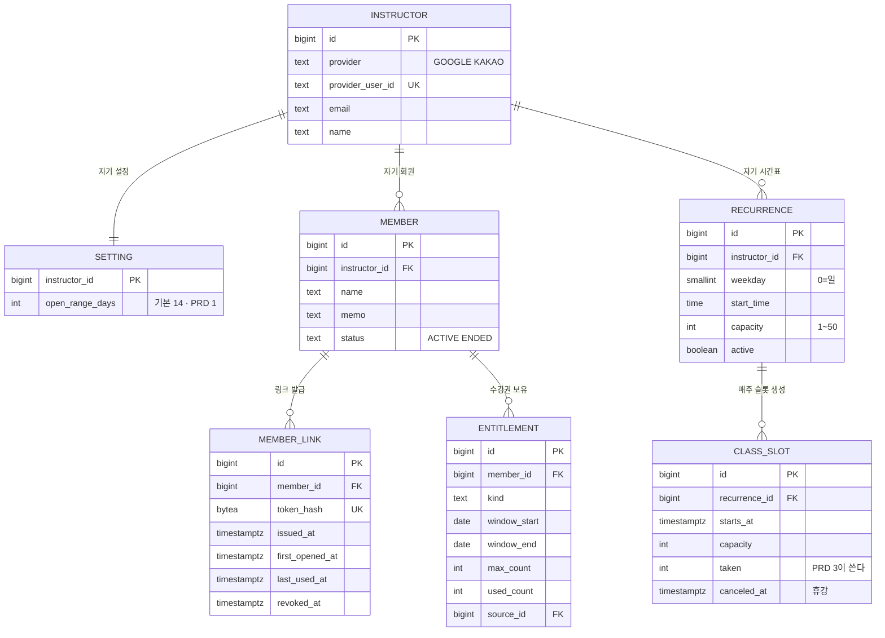

# BE-0001 개발 PRD · 강사 세팅

> **1차 이전본.** Notion "테이블 설계 · ERD" 문서에서 이 기능에 해당하는 부분을 잘라 옮겼다. 내용은 원문 그대로다. [템플릿](../../../templates/prd.md) 형식으로 다시 쓰고 회의 결정을 반영하는 건 2차에서 한다.

## 근거

- 제품 PRD: [PRD-0001](https://github.com/Fit-link-v2/Fit-link-PRD/tree/main/prd/0001-instructor-setup)

## 기술 설계

### 이 기능이 만드는 범위

PRD 1 단계에서 실제로 `CREATE TABLE`하는 것은 이 7개다. `booking` · `waitlist` · `event_log` · `entitlement_adjustment`는 PRD 3 이후에 붙는다.



| 컬럼 | PRD 1이 쓰나 | 지금 넣는 이유 |
|---|---|---|
| `class.taken` | **아니오** | PRD 3 AC 1.3.1의 조건부 UPDATE 대상. 나중에 넣으려면 이미 생성된 슬롯 전부를 backfill해야 한다 |
| `entitlement.used_count` | 예 | AC 3.2.3의 "잔여 = max_count - used_count"와 강사의 수기 수정에 쓴다 |
| `member_link.revoked_at` | 예 | AC 4.3.1 재발급 |
| `class.canceled_at` | 예 (쓰기) | AC 2.3.1 휴강. 읽는 쪽은 PRD 2다 |

표에서 첫 줄 하나만 "PRD 1이 안 쓰는" 컬럼이다. 그리고 그 하나가 **PRD 1의 인수 조건만으로는 도출되지 않는다.**

AC 2.1.1은 `capacity`(정원 상한)를 요구하지만 `taken`(현재 찬 인원)을 요구하지 않는다. PRD 1 범위에는 `booking`이 없어 자리를 차지하는 쓰기 경로 자체가 없고, 따라서 경쟁도 없다. `taken`이 필요해지는 근거는 **"예약이라는 쓰기 경로가 생긴다"**는 사실이고, 그것은 PRD 0(상위 구상)에 있다.

정리하면 이렇다. 세부 인수 조건(PRD 3~5)이 없어도 상위 구상만 있으면 `taken`은 나온다. 그러나 **PRD 1만으로는 나오지 않는다.** 그 상태에서 설계하면 "예약 인원은 `booking`을 COUNT하면 되니 `taken`은 필요 없다"로 가게 되고, 정원 조건부 UPDATE를 쓸 수 없게 된다.

반대로 `booking.restored`(PRD 5)처럼 **PRD 1 시점에 알 수도 없고 나중에 넣으면 비싼** 항목도 남는다. 스키마를 앞 단계 문서만으로 전부 확정할 수는 없다는 뜻이다. 이 문서가 PRD 1~5를 한 번에 읽고 작성된 이유다.

팀원과 공유할 때는 전체 그림과 이 절을 같이 본다. 전체 그림은 "최종적으로 여기로 간다", 이 절은 "이번 단계에 손대는 범위"를 말한다.

### 테이블 정의 (DDL)

#### 1. 강사 · 설정

```sql
CREATE TABLE instructor (
  id               bigserial   PRIMARY KEY,
  provider         text        NOT NULL CHECK (provider IN ('GOOGLE', 'KAKAO')),
  provider_user_id text        NOT NULL,
  email            text,
  name             text,
  created_at       timestamptz NOT NULL DEFAULT now(),

  CONSTRAINT instructor_identity_uk UNIQUE (provider, provider_user_id)
);

-- 강사마다 1행. PK가 곧 소유자다.
CREATE TABLE setting (
  instructor_id         bigint      PRIMARY KEY REFERENCES instructor(id),
  open_range_days       int         NOT NULL DEFAULT 14
                          CHECK (open_range_days BETWEEN 7 AND 28),
  cancel_deadline_hours int         NOT NULL DEFAULT 3
                          CHECK (cancel_deadline_hours BETWEEN 0 AND 72),
  updated_at            timestamptz NOT NULL DEFAULT now()
);
```

비밀번호를 담는 컬럼이 없다. OAuth provider가 인증을 끝내고 우리는 `(provider, provider_user_id)`만 받는다. 유출 시 비밀번호가 새지 않고, 재설정 화면도 필요 없다.

`setting`의 PK가 `instructor_id`이므로 강사당 정확히 1행이 강제된다. 가입 직후 기본값으로 1행을 만든다.

#### 2. 시간표

```sql
CREATE TABLE recurrence (
  id            bigserial   PRIMARY KEY,
  instructor_id bigint      NOT NULL REFERENCES instructor(id),
  weekday       smallint    NOT NULL CHECK (weekday BETWEEN 0 AND 6),  -- 0=일
  start_time    time        NOT NULL,
  capacity      int         NOT NULL CHECK (capacity BETWEEN 1 AND 50),
  active        boolean     NOT NULL DEFAULT true,
  created_at    timestamptz NOT NULL DEFAULT now()
);

CREATE INDEX recurrence_owner_idx ON recurrence (instructor_id);

-- 같은 강사가 같은 요일 · 같은 시각에 규칙을 두 개 두지 못한다.
CREATE UNIQUE INDEX recurrence_slot_uidx
  ON recurrence (instructor_id, weekday, start_time) WHERE active;

CREATE TABLE class (
  id            bigserial   PRIMARY KEY,
  recurrence_id bigint      NOT NULL REFERENCES recurrence(id),
  starts_at     timestamptz NOT NULL,
  capacity      int         NOT NULL CHECK (capacity >= 0),
  taken         int         NOT NULL DEFAULT 0,
  canceled_at   timestamptz,
  created_at    timestamptz NOT NULL DEFAULT now(),

  CONSTRAINT class_slot_uk     UNIQUE (recurrence_id, starts_at),
  CONSTRAINT class_taken_range CHECK (taken >= 0 AND taken <= capacity)
);

-- 회원 화면은 항상 "휴강 아닌 슬롯을 시각순으로" 읽는다.
CREATE INDEX class_open_starts_at_idx
  ON class (starts_at) WHERE canceled_at IS NULL;
```

`class.capacity`는 생성 시점에 `recurrence.capacity`를 복사한다. 반복 규칙의 정원을 나중에 바꿔도 이미 생성된 슬롯은 흔들리지 않는다. 복사하지 않고 참조하면 "그때 정원이 몇이었나"를 영원히 복원할 수 없다.

`class_taken_range`는 예약 트랜잭션의 조건부 UPDATE가 뚫렸을 때를 막는 마지막 방어선이다. 애플리케이션 버그로 정원을 넘기는 UPDATE가 들어오면 DB가 거부한다.

반복 주기는 매주로 고정돼 있다. 격주 · 월 n번째 주는 PRD 1의 범위 밖이다(인터뷰 7번). 넣게 되면 `recurrence`에 `interval_weeks`와 `anchor_date` 두 컬럼이 붙는다. 기존 행은 각각 1과 생성일로 채우면 되므로 나중에 넣어도 비용이 낮다.

#### 3. 회원 · 링크

```sql
CREATE TABLE member (
  id            bigserial   PRIMARY KEY,
  instructor_id bigint      NOT NULL REFERENCES instructor(id),
  name          text        NOT NULL,
  memo          text,
  status        text        NOT NULL DEFAULT 'ACTIVE'
                  CHECK (status IN ('ACTIVE', 'ENDED')),
  created_at    timestamptz NOT NULL DEFAULT now()
);
-- name에 UNIQUE를 걸지 않는다. 동명이인 허용이 인수 조건이다 (PRD 1 AC 3.1.2).

CREATE INDEX member_owner_idx ON member (instructor_id, status);

CREATE TABLE member_link (
  id              bigserial   PRIMARY KEY,
  member_id       bigint      NOT NULL REFERENCES member(id),
  token_hash      bytea       NOT NULL UNIQUE,   -- SHA-256, 32바이트
  issued_at       timestamptz NOT NULL DEFAULT now(),
  first_opened_at timestamptz,
  last_used_at    timestamptz,
  revoked_at      timestamptz
);

-- 회원 1명에게 살아 있는 링크는 최대 1개.
CREATE UNIQUE INDEX member_link_active_uidx
  ON member_link (member_id) WHERE revoked_at IS NULL;
```

토큰 원본을 담는 컬럼이 없다. 이것이 PRD 1 AC 4.1.2의 물리적 표현이다. 원본은 발급 응답에만 실려 나가고 DB에는 남지 않는다.

`token_hash`가 **전역 UNIQUE**다. 강사가 몇 명이든 토큰은 16바이트 난수라 충돌하지 않는다. 토큰 하나가 회원 한 명을 가리키고, 그 회원의 `instructor_id`가 어느 강사의 시간표를 보여줄지 결정한다. 회원 쪽 격리는 이것으로 자동 성립한다.

재발급은 기존 행에 `revoked_at`을 찍고 새 행을 넣는다. 새 행의 `first_opened_at`은 자연히 NULL이므로 AC 5.1.3의 "재발급하면 초기화"가 별도 로직 없이 성립한다. 죽은 행은 부분 유니크 인덱스의 조건을 만족하지 않아 인덱스에 들어가지 않으므로, 재발급이 쌓여도 조회가 느려지지 않는다.

#### 4. 수강권

```sql
CREATE TABLE entitlement (
  id           bigserial   PRIMARY KEY,
  member_id    bigint      NOT NULL REFERENCES member(id),
  kind         text        NOT NULL CHECK (kind IN ('PASS', 'SUBSCRIPTION')),
  window_start date        NOT NULL,
  window_end   date        NOT NULL,
  max_count    int         NOT NULL CHECK (max_count > 0),
  used_count   int         NOT NULL DEFAULT 0,
  source_id    bigint,     -- 월 정액의 원본. 열린 질문 Q5 참조
  created_at   timestamptz NOT NULL DEFAULT now(),

  CONSTRAINT entitlement_window_order CHECK (window_start <= window_end),
  CONSTRAINT entitlement_used_range
    CHECK (used_count >= 0 AND used_count <= max_count)
);

-- 예약 시 "유효한 것 중 만료가 가장 이른 1장"을 고른다 (PRD 3 AC 1.3.5).
CREATE INDEX entitlement_pick_idx ON entitlement (member_id, window_end);
```

횟수권과 월 정액의 차이는 컬럼이 아니라 행의 수명이다. 횟수권은 구매 1건에 행 1개이고 `window`가 유효 기간 전체다. 월 정액은 주기마다 행이 새로 생기고 `window`가 그 주기다. 예약 · 차감 쿼리는 양쪽에서 완전히 같다.

`entitlement_used_range`가 AC 3.2.3의 "0 이상 max_count 이하"를 그대로 담는다. 강사의 수기 수정도 이 범위를 벗어날 수 없다.

##### 월 정액으로 확정될 경우의 미결 사항

`source_id`에 FK를 걸지 않았다. 가리킬 대상이 아직 정해지지 않았기 때문이다.

`entitlement`를 자기 참조하게 두면 조회가 깨진다. 강사가 만든 "구독 설정" 행과 배치가 만든 "주기별 권리" 행이 같은 테이블에 섞이는데, PRD 3 AC 1.3.5의 "유효한 것 중 만료가 가장 이른 1장"에 **구독 설정 행도 걸린다.** 거기서 차감될 수 있다. `source_id IS NOT NULL`로 거르면 횟수권(`source_id`가 NULL)이 빠진다.

해결은 구독 설정을 별도 테이블로 빼는 것이다.

```sql
-- 월 정액으로 확정될 때만 만든다
CREATE TABLE subscription (
  id               bigserial PRIMARY KEY,
  member_id        bigint    NOT NULL REFERENCES member(id),
  count_per_period int       NOT NULL,      -- 주 2회면 2
  period_unit      text      NOT NULL CHECK (period_unit IN ('WEEK', 'MONTH')),
  starts_on        date      NOT NULL,
  ends_on          date,
  active           boolean   NOT NULL DEFAULT true
);
-- entitlement.source_id → subscription.id
```

이러면 `entitlement`에는 실제로 쓸 수 있는 권리만 남는다. PRD 0이 합친 것은 **차감 모델**이고, 구독은 차감 대상이 아니라 행을 만들어내는 설정이므로 별개 개념이다. 합치기 결정과 모순되지 않는다.

여기에 주기별 자동 생성 배치가 따라온다. 회원 15명에 주 2회면 매주 15줄이라 수기 생성이 불가능하다. PRD 1 열린 질문에 이미 기록돼 있다. 횟수권으로 확정되면 `source_id`는 계속 NULL로 남고 이 절 전체가 해당 없음이 된다.

### 마이그레이션

PRD 단위가 배포 단위는 아니다. 1차 배포에는 PRD 1~3이 함께 나간다.

| 마이그레이션 | 내용 | 시점 |
|---|---|---|
| 001 | instructor, setting(open_range_days), recurrence, class, member, member_link, entitlement | PRD 1 |

## AC 대 제약

인수 조건이 어느 제약으로 내려왔는지의 대응표다. 리뷰는 이 표를 기준으로 하면 된다.

| PRD · AC | 요구 | 물리 제약 |
|---|---|---|
| (제품 형태) | 강사끼리 데이터가 섞이지 않음 | `member.instructor_id`, `recurrence.instructor_id`, `setting` PK |
| 1 · AC 2.1.1 | 정원 1 이상 50 이하 | `recurrence` CHECK capacity BETWEEN 1 AND 50 |
| 1 · AC 2.1.3 | 같은 규칙 재저장해도 슬롯 중복 없음 | `class` UNIQUE (recurrence_id, starts_at) |
| 1 · AC 2.2.2 | 배치를 여러 번 돌려도 결과 동일 | 위 유니크 + INSERT ... ON CONFLICT DO NOTHING |
| 1 · AC 2.3.1 | 휴강. 예약이 있으면 확인 창 | `class.canceled_at` + `booking.cancel_reason` (처리는 write-paths 5.2) |
| 1 · AC 2.3.3 | 삭제 · 변경은 해당 슬롯에만 | `recurrence`와 `class`를 분리. 규칙은 안 건드린다 |
| 1 · AC 2.4.1 | 오픈 범위 7~28일 | `setting` CHECK open_range_days BETWEEN 7 AND 28 |
| 1 · AC 3.1.2 | 동명이인 허용 | `member.name`에 UNIQUE 없음 (의도적 부재) |
| 1 · AC 3.2.3 | 잔여는 0 이상 max_count 이하 | `entitlement` CHECK used_count 범위 |
| 1 · AC 3.3.1 | 수강 종료는 삭제가 아님 | `member.status` ENDED. DELETE 경로 없음 |
| 1 · AC 4.1.2 | 해시만 저장 | `member_link`에 원본 토큰 컬럼 없음 |
| 1 · AC 4.3.1 | 재발급 시 이전 링크 무효 | `revoked_at` · member당 유효 링크 1개 부분 유니크 |
| 1 · AC 4.3.2 | 재발급해도 예약 기록 유지 | `booking.member_id`가 링크가 아닌 회원을 참조 |
| 1 · AC 5.1.3 | 재발급 시 최초 접속 초기화 | 새 행의 first_opened_at이 NULL. 별도 로직 불필요 |

"의도적 부재" 세 줄이 리뷰에서 가장 놓치기 쉬운 부분이다. 컬럼이 없는 것이 설계 누락이 아니라 인수 조건이다.

## 열린 질문

| # | 질문 | 영향 |
|---|---|---|
| Q1 | `class` 테이블을 `class_slot`으로 개명할 것인가 | `class`는 **Java 예약어**이고 `Class`는 `java.lang.Class`와 충돌한다. mermaid erDiagram에서도 예약어로 걸려 그림에서만 이름이 다르다. 개명하면 PRD 1 본문의 용어표도 같이 고쳐야 한다. 대안은 `scheduled_class` |
| Q2 | ~~같은 요일 · 시각의 규칙 2개 허용~~ **해소** | `recurrence (instructor_id, weekday, start_time) WHERE active` 부분 유니크로 금지했다 |
| Q3 | `recurrence.capacity`를 바꾸면 이미 생성된 슬롯은 | AC에 없다. 현재 설계는 "안 바뀐다". 강사가 기대하는 동작과 다를 수 있다 |
| Q4 | 타임존 'Asia/Seoul'을 상수로 박을 것인가 | 강사가 여러 명이 되었으므로 `setting`에 컬럼을 두는 쪽이 안전하다. 국내 강사만 받을 것이면 상수로도 된다 |
| Q5 | `entitlement.kind`를 인터뷰 전에 어느 쪽으로 둘 것인가 | PRD 1 AC 3.2.2. 차감 · 조회 스키마는 어느 쪽이든 같다. 월 정액이면 `subscription` 테이블과 주기 배치가 PRD 1 범위에 들어온다 |
| Q7 | PK를 bigserial로 둘 것인가 | 강사당 회원 15~20명 규모면 충분하다. `class_id`는 URL에 노출되지만 비밀이 아니다. 비밀인 것은 `member_link.token_hash` 하나뿐이고 그것만 난수다 |
| Q8 | OAuth provider를 무엇으로 할 것인가 | 현재 CHECK는 `GOOGLE`, `KAKAO` 둘이다. 국내 개인 강사 대상이면 카카오가 자연스럽다. 늘리면 CHECK만 고치면 된다 |
| Q9 | 가입을 열어둘 것인가 | 누구나 가입하면 빈 계정이 쌓인다. 초기에는 초대 코드나 승인을 둘 수 있다. 스키마에는 영향이 작다 |
| Q10 | 휴강 통보를 어떻게 할 것인가 | 휴강 트랜잭션은 강사가 카톡으로 하는 것을 전제한다. 회원이 링크를 열기 전까지 모른다는 뜻이다. 자동 알림은 PRD 0에서 범위 밖 |

## 이전 메모 · PRD 본문과 달라진 부분

> 2차에서 PRD 본문을 고치면 이 절은 지운다.

PRD 1~5가 "강사 1명 · 계정 1개"로 쓰였을 때 작성됐다. 제품 형태가 정해지면서 아래가 달라졌고, PRD 본문도 같이 고쳐야 한다.

| 항목 | PRD 본문 | 이 문서 |
|---|---|---|
| 강사 계정 | PRD 1 기능 1 "단일 계정. 아이디 · 비밀번호" | **OAuth 가입.** 강사마다 1행. `password_hash` 없음 |
| 비밀번호 재설정 | PRD 1 AC 1.1.4 "운영자가 수동으로 처리" | **해당 없음.** 비밀번호를 보관하지 않는다 |
| 설정 단위 | PRD 5 AC 1.1.2 "전역 설정 1개" | **강사당 1개** |
| 데이터 격리 | 언급 없음 | `member` · `recurrence`에 `instructor_id` |
| 휴강 시 예약 | PRD 1 AC 2.3.1이 "PRD 3에서 정의"라 했으나 **PRD 3에 없음** | **write-paths 5.2에 정의.** 전부 취소하고 마감과 무관하게 전부 복구 |
