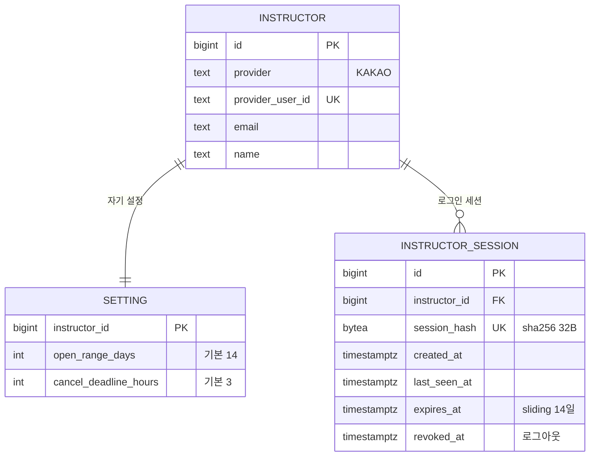

# 강사 도메인 데이터 모델

도메인 사이 관계는 [컨텍스트 맵](../../architecture/context-map.md). 다른 도메인 테이블은 이름과 id만 그렸다.

## ERD

## 테이블

| 테이블 | 도입 기능 |
|---|---|
| `instructor` | 0001 |
| `setting` | 0001 |
| `instructor_session` | 0001 |
