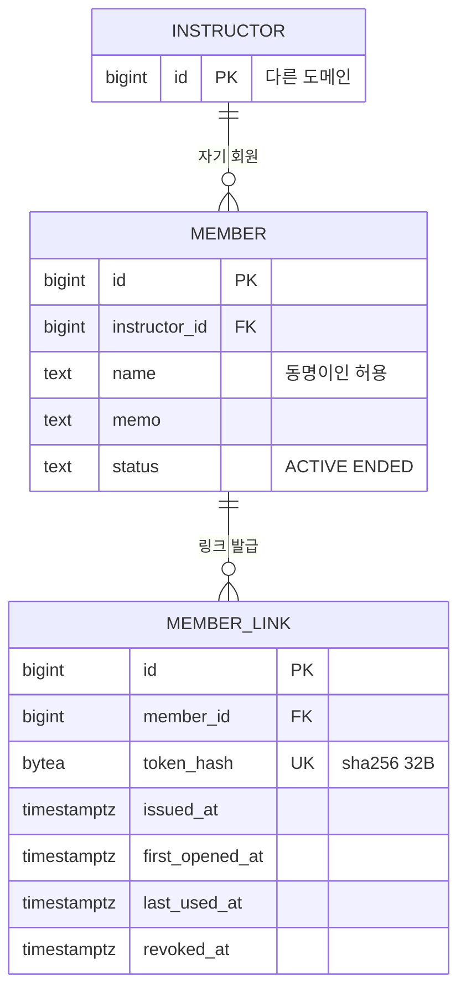

# 회원 도메인 데이터 모델

도메인 사이 관계는 [컨텍스트 맵](../../architecture/context-map.md). 다른 도메인 테이블은 이름과 id만 그렸다.

## ERD



## 테이블

| 테이블 | 도입 기능 |
|---|---|
| `member` | 0001 |
| `member_link` | 0001 |

## 주의할 쿼리

### 회원 화면의 격리

토큰이 회원을 가리키고, 회원이 강사를 가리킨다.

```sql
-- 1. 토큰 검증
SELECT m.id AS member_id, m.instructor_id
  FROM member_link l
  JOIN member m ON m.id = l.member_id
 WHERE l.token_hash = $hash AND l.revoked_at IS NULL;

-- 2. 그 강사의 슬롯만
SELECT c.id, c.starts_at, c.capacity - c.taken AS remaining
  FROM class_slot c
  JOIN recurrence r ON r.id = c.recurrence_id
  JOIN setting    s ON s.instructor_id = r.instructor_id
 WHERE r.instructor_id = $그_강사
   AND c.canceled_at IS NULL
   AND c.starts_at >= now()
   AND c.starts_at <  now() + (s.open_range_days || ' days')::interval;
```

오픈 범위도 강사별 설정에서 읽는다.

### 미개봉 회원 수

```sql
SELECT count(*)
  FROM member m
  JOIN member_link l ON l.member_id = m.id AND l.revoked_at IS NULL
 WHERE m.instructor_id = $me
   AND m.status = 'ACTIVE'
   AND l.first_opened_at IS NULL;
```
